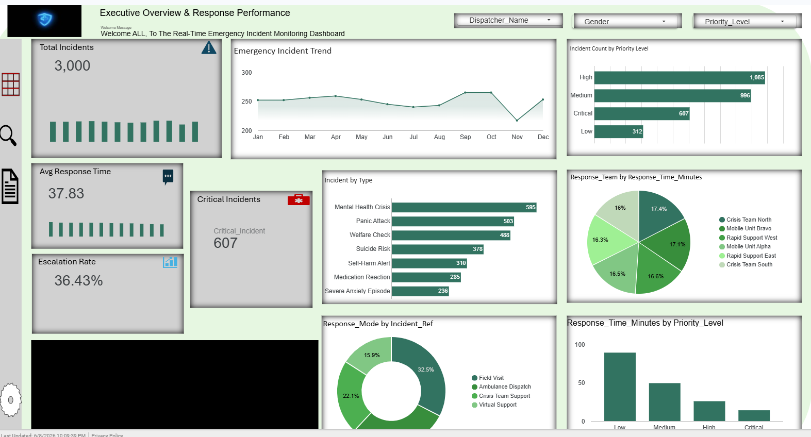
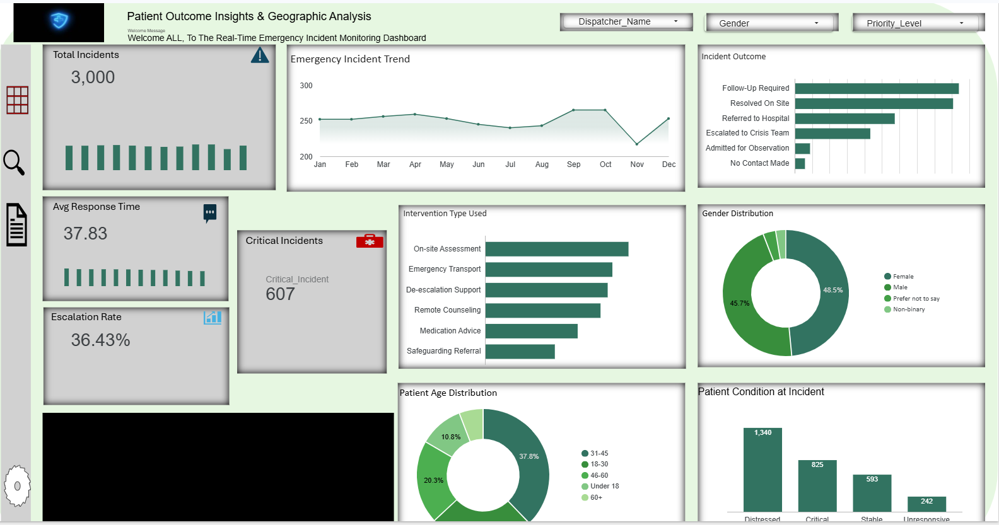
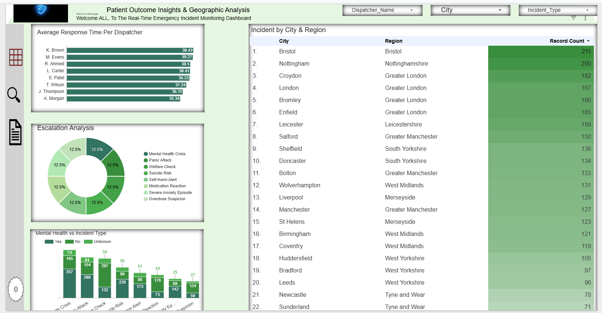

# 🚑 Real-Time Incident Tracking and Outcome Reporting

## 🏢 Company Overview

**HealthResponse Ltd** was founded in 2010 in the United Kingdom with a mission to provide fast, reliable, and efficient emergency response services. From a small local provider, HealthResponse has grown into a key player in the emergency services industry, delivering 24/7 emergency response, patient transportation, and health support services across multiple cities in the UK.

Notable milestones include the launch of its real-time incident reporting system in 2018 and recognition for excellence in emergency management.

### Core Services
| Service | Description |
|---|---|
| Emergency Medical Transport | Rapid response ambulance and medical transport services |
| Patient Monitoring | Continuous health monitoring and reporting for patients in transit |
| Incident Management | Real-time emergency response coordination for hospitals and clinics |
| Community Health Initiatives | Public health programs and emergency preparedness services |

---

## ❗ Business Challenge

HealthResponse Ltd faces significant challenges in managing and tracking emergency incidents from the moment a call is received until the outcome is fully assessed:

- **Manual Incident Logging** — Lack of integration between incident logs, dispatch systems, and patient care records causes delays in decision-making and real-time performance tracking
- **Data Inaccuracy** — Manual processes risk incomplete or incorrect data being logged, impacting the quality of incident reporting and outcomes analysis
- **Delayed Reporting** — Post-incident data aggregation delays insights into performance and patient outcomes, slowing response to emerging trends and operational inefficiencies

---

## 🎯 Project Objectives

1. **Automate Incident Logging** — Implement a system where emergency calls and incident data are logged in real time through Microsoft Forms, reducing manual data entry
2. **Create Real-Time Dashboards** — Use Looker Studio to visualize incident data, tracking response times, treatment details, and patient status in real time
3. **Enhance Data Accuracy** — Ensure all incoming data is validated and integrated seamlessly into Google Sheets via Power Automate
4. **Monitor Operational Performance** — Track KPIs such as response time, treatment effectiveness, and patient recovery rates

---

## 🔄 Workflow

```
Microsoft Forms → Power Automate → Google Sheets → Looker Studio
  (Data Collection)  (Automation)   (Central Database)  (Visualization)
```

1. **Data Collection** — Emergency incident data captured in real time through Microsoft Forms by the dispatcher team
2. **Data Automation** — Power Automate transfers data to Google Sheets instantly
3. **Data Integration** — Google Sheets serves as the central database for all incident and patient information
4. **Real-Time Visualization** — Looker Studio connects to Google Sheets, creating live dashboards
5. **Analysis & Reporting** — Decision-makers analyze trends, performance, and resource needs via the dashboard

---

## 🛠️ Tools Used

- **Microsoft Forms** — Real-time emergency incident data collection
- **Power Automate** — Automated data transfer and integration pipeline
- **Google Sheets** — Central database for incident and patient records
- **Looker Studio** — Interactive real-time dashboards and reporting

---

## 📊 Dashboard Preview





> 🔗 **[View Live Looker Studio Dashboard](https://datastudio.google.com/u/0/reporting/34216d1e-ea3a-4e9e-b8d5-c6bb930841c5/page/kwuvF)**
> 🔗 **[View Live Dataset](https://docs.google.com/spreadsheets/d/1i7x2dYevjV9jzYMmPcQSt04LM3xeLSJM/edit?rtpof=true)**


---

## 💡 Key Findings & Recommendations
- **Total Incidents: 3,000 incidents recorded, with 607 classified as critical and an escalation rate of 36.43%** 
- **Average Response Time: 37.83 minutes across all dispatchers, with K. Brown having the highest at 39.43 minutes and A. Morgan the lowest at 35.34 minutes** 
- **Incident Trends: Incident volume remained relatively stable between 250–300 monthly, with a noticeable dip in November before rising again in December** 
- **Priority Breakdown: High priority incidents led at 1,085, followed by Medium (996), Critical (607), and Low (312)**
- **Top Incident Types: Mental Health Crisis (595) and Panic Attack (503) were the most frequent, together accounting for over 36% of all incidents**
- **Geographic Hotspots: Bristol (211) and Nottingham (200) recorded the highest incident counts, with Greater London collectively representing a significant share across Croydon, London, Bromley, and Enfield**
- **Patient Conditions: The majority of patients arrived in a Distressed state (1,340), followed by Critical (825), Stable (593), and Unresponsive (242)**
- **Most Used Intervention: On-site Assessment was the most common intervention, followed by Emergency Transport and De-escalation Support**

### Recommendations
1. Target High-Incident Cities — Deploy additional resources to Bristol, Nottingham, and Greater London where incident volumes are consistently highest
2. Reduce Response Times — Investigate why K. Brown, M. Evans, and L. Carter have above-average response times and provide targeted training or workload rebalancing
3. Mental Health Focus — With Mental Health Crisis and Panic Attacks making up over a third of all incidents, invest in specialized mental health responders and de-escalation training
4. Address the November Dip — Investigate the drop in incidents in November — this could reflect underreporting, staffing gaps, or data collection issues
5. Critical Incident Preparedness — With 607 critical incidents and 242 unresponsive patients, ensure rapid response protocols are consistently reviewed and updated
6. Follow-Up Process — Since Follow-Up Required is the most common outcome, establish a structured follow-up workflow to ensure no patient falls through the cracks
7. Expand Virtual Support — Virtual Support accounts for only 15.9% of response modes; expanding this could reduce pressure on field teams for lower-priority incidents

---

## 📁 Repository Structure

```
healthresponse-incident-tracking/
│
├── README.md
├── Dashboard.png                  ← Looker Studio dashboard screenshot
└── data/                          ← Sample/anonymised incident datasets
```

---

## 👤 Author

**Adewoye Oluwatimilehin Joseph**
[LinkedIn Profile](https://www.linkedin.com/in/adewoye-oluwatimilehin/)
